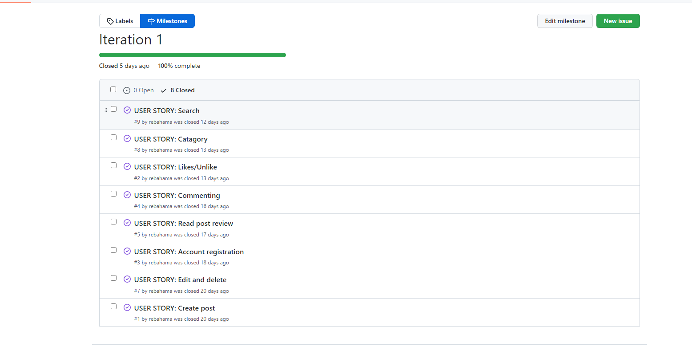
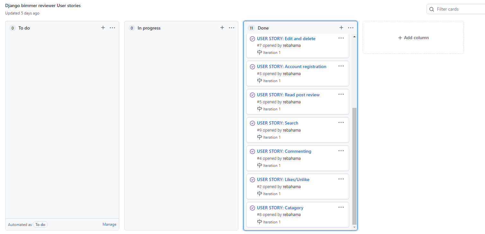

# Agile

# Overview
The first thing that I did was to look at the user stories and from there I was planning what user stories I must have in order for this project to succeed. I prioritized depending on the "must have" "could have". I had around 10 user stories and 2 iterations sprints. The prioritization was also based around the requirements for this project to pass.

# All the user stories

## Must have
* As a user I would like to be able to create/delete and edit a post.

* As a user I would like to be able to create an personal account on the site.

* As a user I would like to be able to comment on a post/review.

* As a user I would like to be able to like a post/review and to know how many other have alredy liked the same post.

* As a user I would like to be able to search on the site after a certain title in the review.

* As a user I would like a certain car model to be categorized so that I can click on the car model

* As admin i would like to inspect a post before it is approved and published on the site.

* As admin I would like to delete a post if it is inappropriate.

## Could have

* As a user I would like to be able to upload a picture on the post review.

* As a user I would like to get notified if I click like on a post or if a comment have been successfully created.

* As a user I would like a map where meetups can be shown and displayed.

# Sprints
I had 2 sprints and each sprint lasted 14 days.

## Sprint 1
Firstly I made the userstories on a Kanban board that went to the backlog before I choose which user stories should proceed to iteration one.

Then I decided that these userstories should proceed to iteration 1, iteration 1 would be due around 15/7-2022.

I did not add too many user stories to iteration 1 because this was my first agile approach.

But I did really good on the time because the code for the important user stories was finished and then I decided to add more userstoires to iteration 1.

After about a week into the first sprint I got the following userstories done:

Right before the first sprint was due I did the following user stories done on sprint 1:

## Iteration 2
Iteration 2 was due around the 28/7 -2022, So I added the following user stories to the second sprint:

I became done with all the userstories in time and after about 9 days the following user stories was completed.

All the user stories completed before the time was due on second sprint:

## Conclusion
This was my first agile approach and from the beginning I was a little careful of not to add to many user stories to the first sprint, but I adapted and after completing most of the stories I decided to add more. On the second sprint I did not have to many user stories but I did the mistake to not add testing and writing documentation on the agile approach, I underestimated the time it would take to make the test and writing the documentation I thought it would be completed quickly but I was wrong, on my next project I will also take in to account for documentation and testing in my agile approach planning.

* Click here to go back to the README file [README](https://github.com/rebahama/bimmer-reviewer/blob/main/README.md)