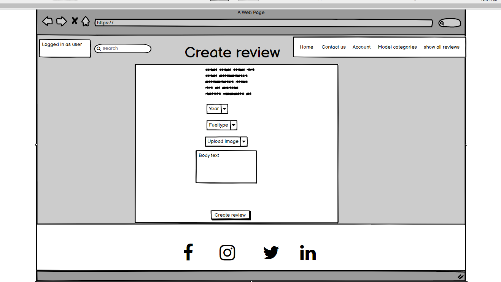
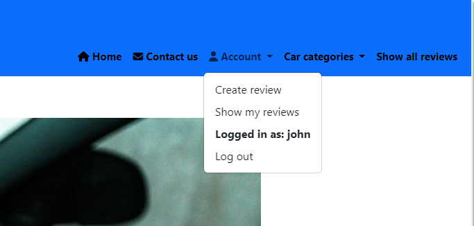

# Bimmerreviewer
Bimmerreviewer is a social media web application where users can create post reviews about their cars. Users will be able to create an account and upload information about their car with a picture. Users will be able to comment on a post and like the review post with a counter that displays the upvotes. The target group here is users that drive a BMW car, the goal with this site is that users will be able to display pro and cons about a specific car model that will be shared on the site.

# Website link
* [Bimmerreviewer website](https://bimmer-reviewer.herokuapp.com/index)

# User stories

## Site users
* As a user I would like to be able to create/delete and edit a post.

* As a user I would like to be able to create an personal account on the site.

* As a user I would like to be able to comment on a post/review.

* As a user I would like to be able to like a post/review and to know how many other have alredy liked the same post.

* As a user I would like to be able to search on the site after a certain title in the review.

* As a user I would like a certain car model to be categorized so that I can click on the car model

* As a user I would like to be able to upload a picture on the post review.

* As a user I would like to be get notified if I click like on a post or if a comment have been successfully created.

* As a user I would like a map where meetups can be shown and displayed.

## Admin
* As admin i would like to inspect a post before it is approved and published on the site.

* As admin I would like to delete a comment/post if it is inappropriate.

# Wireframes

## Homepage
* The front page have an intro text that describes shortly what the site is about and that the user should get registered for an account. On the bottom there is an API call to google map to show where there are meetups. On the top left the user can search after a certain review.

## Create review
* Here the user would be able to create the review, the user will be informed with a text and then the user will input the information that is required and upload the review.

## All reviews 
* All the reviews that are created will be displayed on this page, on big screens the review cards will be displayed as 3 per row and on medium screens 2 per row and lastly on small screens 1 per row.

## My reviews
* Here only the personal reviews that the user have created will be displayed. The user must be logged in and the reviews must have been created by the user to be displayed on this page. The user can choose to delete,edit or view the review from this page.

## View review
* Here is the detailed information that the user have written in the review alongside with a picture. The user can also like the review and add a comment on this page.

# Database diagrams
The relatinoal database that I will be working with in this project will be Postgressql. Here is the diagrams for my database, I have one for comments and one for the reviews.

## Post reviews:
 

## Comments:

# Features and functionality 

## Frontpage
The user will be welcomed with a intro and animation on the front page, on the top is a navigation menu and on the left top is a search bar. The user will be able to search after post with a certain title with the help of the search bar. The intro text will present with a button that takes the user to a register page. If the user is alredy logged in then the register button wont be displayed.

On the bottom there is a Google map along with a footer, the map is only for development purpose for this project.

## Account
If the user is not logged in to the page then the following will be displayed:

if the user is logged in to the page then the following will be displayed:

## The register page: 
Here the user can register to create an account. After filling in the information the user will get a conformation email so that the user can confirm the account. If the user types in an email or username that alredy exist then the user gets a message display informing that.

## Verify email:
After the user have registered an account the following page will be displayed and an email will be sent to verify the email to the account that the user typed in:

## Confirm email:
Afte the user have recived the email and clicked on the link the user will be directed to this page below to confirm their email account:

## Sign in:
After clicking confirm email adress the user will be directed to the sign in page, a message will be displayed telling the user that the email adress have been confirmed:

## Sign out:
When the user clicks log out the following page will be shown, if the user clicks sign out a message will be displayed telling the user that the sign out was completed.

Everytime the user signs in a message will be showing displaying the username:

## Create review:

This is where the magic happens, the user will be presented with a text explaining what to do. The title here must be unique and if the user tries to type in a title that alredy exist then a message will be displayed. If the user tries to upload a image to big or another format then a picture the page will display an "500" error. The price can't go below 0 and the year along with the fueltype only have prepopulated choiches thanks to the model that I created. If no image is uploaded then a default image will be uploaded instead of an empty file.

After the user have clicked "upload review" the message below will be displayed:

Admin needs to approve the post before it can be seen on the webpage. On this page admin can review the created post and see all the data that have been posted by the user.

## My reviews:
This page shows all the personal user reviews that the user have uploaded, only the post that have the same user id as the user that is logged in is displayed here. And each post have 3 buttons, "update" "delete" and "view". Only authenticated user can see this page. 

## Update review:
When the user clicks the update review button the page below will be shown. Here the user can just update the data and click "update review".

Afte the user have updated the info following message will be shown:

## Delete review
When the user clicks the "delete review" button the following page will be displayed:

After the user confirms the delete following message will be displayed and the review is no longer avalible.

## View review
This is the page where all the detailed information is shown, all the data that the user inputed in the create review page will be shown on this page below:

## Comments
On the same page the user will be able to comment and like a review.
After clicking "add comment" user will be directed to the page below to add a comment. If there are no comments a text will be displayed saying "no comments yet". The user can type in a author and then type in the comment in the bodyfield.

After the comment have been posted a message will be displayed:

The comment will be displayed like the picture below as you can see the name that the user typed before and date is also shown.User can also hide and show the comments with the help of a button.

## Like 
The user will be able to like a post and a counter is displaying showing how many have liked the post:

When the user likes a post the counter will increase and a message will be displayed telling the user that they have liked this post or unliked a post.

## Category
The category page is displaying all the reviews that is in the relevant category. When the user creates a review depending on which category the user chooses in the input field, the review will be displayed on that page that the user have choosen. In the picture below, the user choose 3-SERIES as a category. The review will then be displayed on the 3-SERIES category page. Only the 3-SERIES will be shown on this page.

There are 4 diffrent categories that the user can choose from when creating the review on the create review page. The image below shows all the categories:

## Show all reviews
This is the page where all the reviews are displayed from all the users on the site. It dosen't matter what category is choosen all the reviews are collected and shown here. This page is not personal and anyone can view this page

## Search
The user can search after a certain title after clicking search the post that have the same or similar title as the inputed serach word will be displayed. Also whatever the user types in will also be shown on the page.The username is also displayed to the left so that the user will always know who is logged in.

If the user types nothing the following page will be displayed:

## Contact us
If the user have any questions there is a contact us page where an email is displayed.

## Please log in
When the user tries to access a page that requires to log in then the following page will be shown the word log in is also a link that takes the user to the sign in page:

## 404 and 500 error page:
If a page is not found or if there is a error the following page will be displayed:

## Back to top:
A button that will automatically take the user back up to the top of the page when the user clicks it.

# Future ideas

* Include admin approval for comments

* Include a from on the contact us page where the user can automatically send email.

* Site users should be able to delete their own comments.

* Site users can upload more then one image.

* The images should be displayed as arrows with carousels.

# Technology

* The structure of the webpage was created with HTML5.

* The styling was created with CSS3.

* Bootstrap was used for responsiv design and some styling.

* Django was used as a MVC.

* Jinja tags was used for the logic on the HTML5 pages and retrive data from the database.

* The database was created with Postgresql.

* Some functions as show/hide buttons and "top page" buttons was created with Javascript.

* Github was used as version system control.

* The project is deployed with Heroku.

* The static files and images are hosted by Cloudinary.

* All the packages installd can be found here: [Requirements](https://github.com/rebahama/bimmer-reviewer/blob/main/requirements.txt).

# Supported screens

* Ipad Air/Ipad Mini.

* Iphone 4/6/7/XR/12 and 12 pro.

* Samsung Galaxy S8/S20.

* Nesthub Max.

* Pixel 5.

# Testing site and deployment

* Testing and deployment is in a seperate document that can be found here: [Testing and deployment](https://github.com/rebahama/bimmer-reviewer/blob/main/TESTING.md)

# Agile development

* I have documented my agile approach in this file : [Agile](https://github.com/rebahama/bimmer-reviewer/blob/main/TESTING.md)

# Source code
To acess the source code in Gitpod.

1. Go to this repository [Repository](https://github.com/rebahama/bimmer-reviewer)

2. Click on the green button texted "Gitpod"

3. Before you can start the program you need to install the pip3 packages and add the enviorment variables that can be found in the section "deployment" in this file: [pip3 Packages](https://github.com/rebahama/bimmer-reviewer/blob/main/TESTING.md).

4. After installing all the packages and declaring the enviorment variables type pyton3 manage.py runserver in the terminal.

Website link can be found here: [Bimmerreviewer website](https://bimmer-reviewer.herokuapp.com/index)

# Credits

## Content

* The symbols in the navigation bar was taken from fontawesome [Symbols](https://fontawesome.com/)

* Inspiration was taken from Code institue blog walkthrough  [I think blog](https://learn.codeinstitute.net/courses/course-v1:CodeInstitute+FST101+2021_T1/courseware/b31493372e764469823578613d11036b/fe4299adcd6743328183aab4e7ec5d13/).

* Some code to Display the category was taken from the help of this video [Category video](https://www.youtube.com/watch?v=_ph8GF84fX4).

* Some coding practice was taken from the Django documentation [Django documentation](https://docs.djangoproject.com/en/4.0/)

* Some of the design was taken from the Bootstrap documentation [Django documentation](https://getbootstrap.com/docs/5.0/getting-started/introduction/) 

* Some Javascript documentation was taken from this site [Javascript documentation](https://www.w3schools.com/) 

## Media

* All the pictures was taken from [Pexel](https://www.pexels.com/sv-se/)