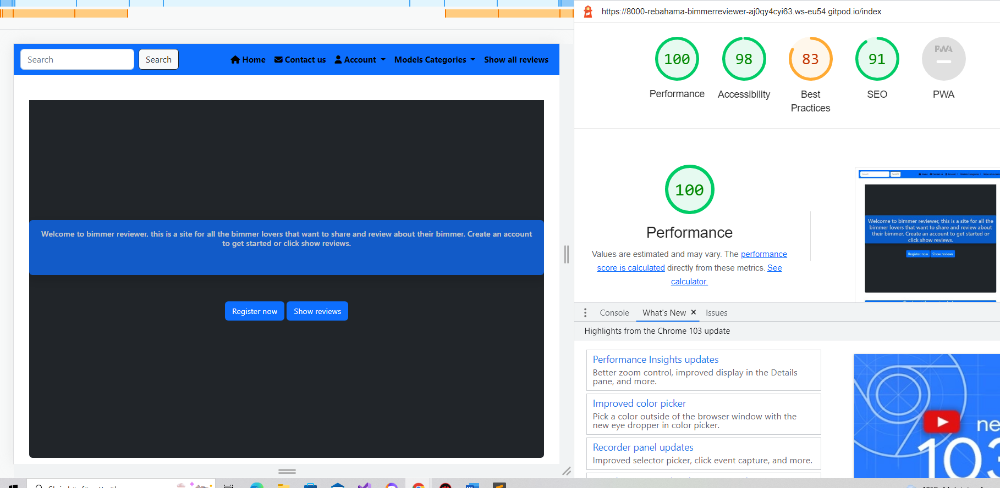

# Manual Testing 

## Testing the user stories on the site

* As a user I would like to be able to create/delete and edit a post.

 On the site you can create/delete and edit a post as long as your are signed up and logged in.

* As a user I would like to be able to create an personal account on the site.

There is a link where you can create your own personal account and testing for that have been done.

* As a user I would like to be able to comment on a post/review.

You can comment on a post as long as you are logged in.

* As a user I would like to be able to like a post/review and to know how many other have alredy liked the same post.

You can like a post when you are logged in

* As a user I would like to be able to search on the site after a certain title in the review.

There is a input box on the top that allows users to search after a certain title. It have been tested and if you input no text there will be a text to encourage the user to put in text in the field.

* As a user I would like a certain car model to be categorized so that I can click on the car model.

There are categories created for certain type of car models that the user can post on. The test for this is that a review have been created for each of the categories and all the reviews showed upp on each category.

* As a user I would like to be able to upload a picture on the post review.

You can upload a picuture on the create review page, if the user uploads another file or a picture too big the user will be redirected to the error page. The user can start over after clicking the button on the error page. If the user does not upload a picture a default image will be uploaded so that no reviews are left with an empty image.

* As a user I would like to be get notified if I click like on a post or if a comment have been successfully created.

Every time the user comments and likes a post there will be a message displayed on top of the page that notifies the user.

* As a user I would like a map where meetups can be shown and displayed.

There is a Google maps displayed on the bottom of the page but this is only for development issues. On Chrome dev tools there is a warning displayed that I must create a billing on google site. But since this is only for devolopment and learning i choose to ignore that warning for now since that wont affect anything.

## Admin

* As admin i would like to inspect a post before it is approved and published on the site.

No reviews will be displayed on the web page untill admin approves the post in django admin page.

* As admin I would like to delete a comment/post if it is inappropriate.
Admin can delete a post/user and comment. If admin deletes the user then all the post, likes and comments connected to that user will also be deleted.

# Website testing

## Links
* All the links lead to relevant pages.

## Error pages

* Custom error pages have been created so that the user can easily start over if there is an error.

## Email

* Gmail was used for sending email as a smtp service. 

* The user gets an email when creating an account to confirm the email.

* If the user forgets the password then the user can request email for forgotten password. 

## Account 

* If a username or email is alredy registered a warning message will be displayed.

* The user must use a username to sign in to the account.

* Only members of the site can access authorized data and content.

* Only created content relevant to the user id can be deleted or edited. One user can not access and edit another users content.

## Search field

* The serach field will display warning if its empty.

* The serach field will display relevant content when text is inputed in the field.

## Error pages

* When there is not a relevant path then the custom error message is displayed.

* When the user puts a to big image or not a image type content in the image field when creating a review then the user will be send to the 500 error pages where the user can click home to start over.

## Responsiv screens
The following screens have been tested:
* Ipad Air/Ipad Mini.

* Iphone 4/6/7/XR/12 and 12 pro.

* Samsung Galaxy S8/S20.

* Nesthub Max.

* Pixel 5.

## Back to top / hide and show buttons

* The Javascript buttons have been tested and works when the user interacts with the buttons. And no erros is displayed apart from the google billing.

# Lighthouse
## Homepage

* The error from google billing account affected my "best practice" score. But since it is only for development purpose I choose to ignore that for now.

* The same score was displayed for mobile. 

# Deployment
* Heroku is used for hosting the website.

* The following packages needs to be installed on Github:

 ### "pip3 install  "django<4" gunicorn"

 ### "pip3 install dj_database_url psycopg2"

 ### "pip3 install psycopg2"

 ### "pip3 install dj3-cloudinary-storage"

 ### "pip3 install django-allauth"

 ### "pip3 install django-crispy-forms "

 ### "pip3 install whitenoise"

 

* Install all the requirements with the "command pip3 freeze --local  >  requirements.txt"

* Create a file named "Procfile" in the main directory django project

## To use the secret key and database variables you need access to the Heroku account that stores the database and secret key and other sensitive data.

* Create the Heroku app, then click on the "Resource" tab.

* Add a database in the "addons" and choose: "Heroku Postgres".

* Go to settings tab.

* On the config vars add the following variables:

1. CLOUDINARY_URL = value from heroku account

2. DATABASE_URL = value from heroku account

3. EMAIL = value from heroku account

4. PORT = 8000

5. SECRET_KEY = value from heroku account

6. SECRET_PASS = value from heroku account

## After adding all the config variables you need to migrate the changes from the model with the command lines below:

* Type in the command line python3 manage.py makemigrations 

* Type in the command line python3 manage.py migrate

## Access enviorment variables

* To access the enviorment variables from Heroku to this project add the following lines:

  * SECRET_KEY = os.environ.get('SECRET_KEY')

  * CLOUDINARY_STORAGE = {
    'CLOUDINARY_URL': os.environ.get('CLOUDINARY_URL')
}
  
  * EMAIL_HOST_USER = os.environ.get('EMAIL')
  
  * EMAIL_HOST_PASSWORD = os.environ.get('SECRET_PASS')

  * DATABASES = {
    'default': dj_database_url.parse(os.environ.get("DATABASE_URL"))
}

  * Dont forget to import dj_database_url and os 

# Bugs

## Solved bugs
* When the project was deployed to Heroku and debug set to false, all my static files stopped working, at first I thougth there was an issue with the host service because Cloudinary is hosting all my static files. Installed "Whitenoise" but website would still not retrive the static files after many hours of debugging and help from tutor: Scott it turned out that my image files needed to include jinja syntax for file path instead of a regular file path. And after changeing out all the regular filepath with the jinja syntax for static files in Django and write the command "collect staticfiles" after 20 minutes everything started to work.

* When I created the Javascript file and started to add "eventlisteners" I Got a error in the chrome dev tools that said "Refrence error undefied", the solution for this was to add a Javascript file for every html page that was using Javascript code. I created 3 Javascript files and splitted upp my code and after that the error was not showing up.

# Validation of files

* The CSS file was validated with Jigshow and no errors was found. [Validate CSS](https://validator.w3.org/).

*  The HTML5 files was validated with  the offical w3 html validation.[Validate html](https://validator.w3.org/). Only error I got was related to Jinja syntax tags, I choose to ignore the warnings.

*  The Javascript files was validated by [Validate Javascript](https://jshint.com/).
For Javascript files I got the warning that "google is not defined" but since all the code is needed for the API call I ignored the warning.

* The Python files was validate by [Validate Python](http://pep8online.com/).
Only error I got from the python files was from my views.py file on line 80
And on settings.py file line 134 and 70 "Line to long".

I tried to make it shorter but the files would display an error so I left that.